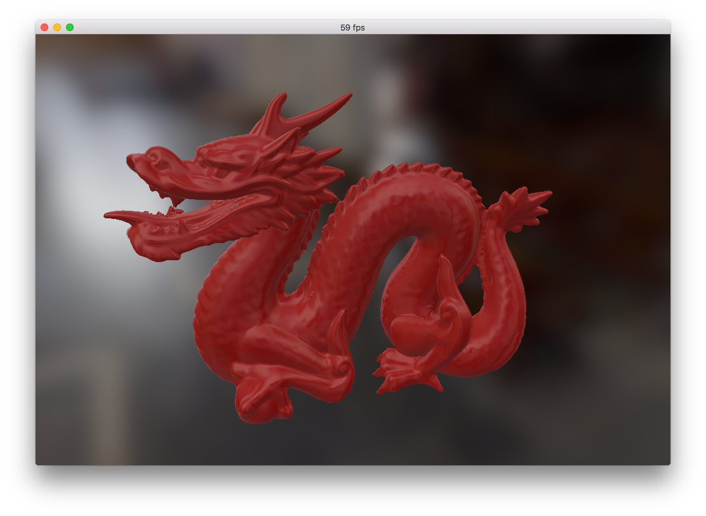

# Cinderloader

#### obj loader

#### Supported platforms:
* MacOS
* Windows 
* Linux, For dependencies and CMake file have a look at the official [Cinder repo wiki](https://github.com/cinder/Cinder/wiki/Cinder-for-Linux).

#### Depends on:
* [Cinder](https://github.com/cinder/Cinder) as the cross-platform creative coding framework.

Example:

